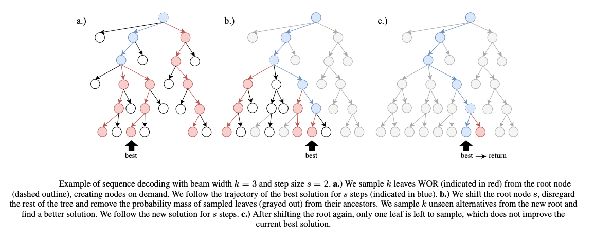

# Self-Improved Neural Virtual Network Embedding with TaSaR

This repository applies **TaSaR** (*Take a Step and Reconsider*, ECAI-2024,
[10.3233/FAIA240707](https://ebooks.iospress.nl/doi/10.3233/FAIA240707)) — a sequence-decoding
method for self-improved neural combinatorial optimization — to a **new problem class:
Virtual Network Embedding (VNE)**.

It is a fork of [gumbeldore](https://github.com/grimmlab/gumbeldore) (the codebase the TaSaR
paper builds on). The original TSP / CVRP / JSSP / Gomoku scaffolding is preserved; the
substantive new work is the **`vne/` problem package** and a full experimental program (data
generation → supervised baselines → self-improving learning → inference scaling → generalization).



---

## TL;DR — what we built and found

- A complete **VNE problem implementation** for the TaSaR/gumbeldore framework: ILP-labelled
  instance generation (HiGHS **and Gurobi**), an LEHD-style and a BQ-style policy network, the
  VNE MDP/trajectory, dataset/replay, and the `vne_main.py` training entrypoint.
- **Self-Improving Learning (SIL) with TaSaR works for VNE.** Seeded from a supervised model and
  trained on its own TaSaR-decoded solutions, the policy reaches **100 % feasibility and ~0 %
  optimality gap** at high inference budget on the in-distribution test set — solving it.
- **Search is what carries quality and generalization.** More beam width / TaSaR budget
  monotonically improves feasibility and gap; greedy alone is weak. Models trained on 60–80-node
  substrates stay **~87 % feasible out to 2.3× and ~50 % at 4.6×** larger substrates, **with no
  retraining**.
- A **behaviour-preserving 8.6× speedup** of VNE TaSaR data generation (56 s → 6.5 s per
  70-node instance) made the whole program tractable on a single GPU.

Full numbers and methodology: [`docs/PHASE2_RESULTS.md`](docs/PHASE2_RESULTS.md),
[`docs/PHASE3_RESULTS.md`](docs/PHASE3_RESULTS.md), [`docs/PHASE4_RESULTS.md`](docs/PHASE4_RESULTS.md).

---

## The VNE problem (extended formulation)

Given a **substrate network** (communication nodes connected by bandwidth-carrying links, each
optionally attached to a compute node) and a set of **virtual requests** (chains of virtual nodes
with compute demands, connected by virtual links with bandwidth demands), **embed every request**:
map each virtual node to a substrate node and route each virtual link along a substrate path,
**without exceeding any node's compute or any link's bandwidth capacity**, minimising total
embedding cost.

To make the problem a clean **sequence-decoding** task, we use the *extended VNE* formulation
(resources defined at the link level; one decision = pick a feasible substrate path for the next
virtual link). The objective is **lexicographic: feasibility first, then cost.** Instance optima
are obtained by solving an exact ILP. See [`vne/PROBLEM_FORMULATION.md`](vne/PROBLEM_FORMULATION.md)
for the formal definition.

**Default scale:** 60–80 substrate communication nodes, 10–20 virtual requests/instance, 2–5
virtual nodes/request.

---

## Method

**TaSaR self-improving learning.** Start from a supervised checkpoint, then repeat each epoch:
generate fresh instances, decode high-quality solutions with **TaSaR** (commit to the best
partial solution for `replan_steps` (`s`) actions, then sample alternatives without replacement
with beam width `k` under constant Top-p), and train one epoch on those self-generated labels.
The TaSaR decoder lives in `core/incremental_sbs.py::IncrementalSBS.perform_tasar`.

**Two policy architectures** (pick via `architecture`):
- **BQ** (`vne/bq_network.py`) — a single unified transformer over `[nodes | edges | virtuals |
  candidates]`.
- **LEHD** (`vne/network.py`) — an encoder/decoder over the substrate and candidate paths.

> ⚠️ **TaSaR requires Top-p < 1.** `min_nucleus_top_p = 1.0` is un-truncated sampling
> (= the Gumbeldore / WOR-SBS *baseline*), **not** TaSaR. Use e.g. `0.9` (env `VNE_MIN_TOP_P`).

---

## Experimental program (results)

| Phase | What | Headline result | Doc |
|-------|------|-----------------|-----|
| **1** | Supervised baselines (BQ-128, LEHD-128) | trained seed models | — |
| **2** | TaSaR SIL — paper-style table (BQ + LEHD) | inference scaling → **100 % feas, 0 % gap**; SIL ≫ supervised | [PHASE2](docs/PHASE2_RESULTS.md) |
| **3** | Multi-beam evaluation (beam 1→64) | feas 53→99 % / 56→99.6 %, gap falls monotonically; TaSaR > beam search at matched budget | [PHASE3](docs/PHASE3_RESULTS.md) |
| **4** | Generalization (no retraining) | gap to 1.35×; **feasibility ~87 % to 2.3×, ~50 % at 4.6×** | [PHASE4](docs/PHASE4_RESULTS.md) |

Reporting is aligned with the TaSaR paper's Table 1 (per-architecture `SL → GD SIL → Ours`
rows; node-transition compute budget `g(k,s)`), with VNE-specific extensions documented inline:
**feasibility%** (the paper's domains are always feasible) and **gaps averaged over F\*** (the
set of instances feasible under every compared method, so they are orderable).

Figures: `artifacts/vne_phase2_sil_curve.png`, `artifacts/vne_phase3_beam_scaling.png`,
`artifacts/vne_phase4_feas_vs_scale.png`.

---

## Repository layout

```
vne/
  config.py                    VNEConfig — all hyperparameters, paths, scale ranges
  trajectory.py                VNE MDP: state, transitions, candidate-path enumeration, cost
  features.py                  build_vne_state_input — tensors from MDP state
  bq_network.py / network.py   BQ (unified) and LEHD (encoder/decoder) policy networks
  dataset.py                   RandomVNEDataset — loads pickles, indexes decisions
  instance_generator.py        random substrate + virtual requests
  validation_set_generator.py  exact ILP labelling (PuLP; HiGHS / Gurobi / CBC backends)
  PROBLEM_FORMULATION.md       formal problem definition
core/
  incremental_sbs.py           perform_tasar — the TaSaR decoder
  gumbeldore_dataset.py        Ray-parallel data generation
  train.py                     main_train_cycle — shared supervised / SIL loop
vne_main.py                    VNE entrypoint (training, validation, test, env overrides)
scripts/
  vne_gen_parallel.py          parallel ILP-labelled generation (Gurobi, multiprocessing)
  vne_gen_unlabeled.py         no-solver instance generation (for feasibility tests)
  vne_eval_table.py            evaluate a checkpoint across budgets (greedy / BS / TaSaR)
  vne_assemble_table.py        cross-checkpoint paper-style table (global F* gaps)
  vne_phase3_table.py          multi-beam table + figure
  vne_genscale_table.py        feasibility-vs-scale table + figure
  vne_hotpath_harness.py       single-instance profiler + equivalence harness
docs/                          PROBLEM_FORMULATION, HANDOFF, PHASE{2,3,4}_RESULTS
```

---

## Quickstart

### Environment

Python ≥3.10 (3.11 used). Create a venv and install deps:

```bash
python -m venv .venv && source .venv/Scripts/activate   # Windows; use bin/activate on Linux
pip install -r requirements.txt
```

**GPU note (Blackwell / RTX 50-series, sm_120):** the default `requirements.txt` targets CUDA
12.1; Blackwell needs a newer wheel. Install a matching CUDA build, e.g.:

```bash
pip install torch==2.11.0+cu128 --index-url https://download.pytorch.org/whl/cu128
```

**Gurobi (optional, for fast ILP labelling):** if Gurobi is installed and licensed, install the
matching bindings so PuLP can use it: `pip install gurobipy==<your_version>`. The generator falls
back to HiGHS (no license needed) otherwise.

### Generate ILP-labelled data

```bash
# parallel, Gurobi-labelled (keep node count modest — labelling cost grows fast with size)
python scripts/vne_gen_parallel.py --nodes 60 80 --num 2000 --workers 8 --threads 4 \
    --solver gurobi --time-limit 60 --out data/vne/vne_test_dataset_2k.pickle
```

### Train

`vne_main.py` is driven by `VNEConfig` and a set of `VNE_*` environment overrides (so you can run
experiments without editing `config.py`). Example — a genuine TaSaR SIL run, GPU generation:

```bash
VNE_ARCHITECTURE=bq VNE_EMBEDDING_DIM=128 \
VNE_LEARNING_TYPE=gumbeldore VNE_SEARCH_TYPE=tasar \
VNE_BEAM_WIDTH=8 VNE_REPLAN_STEPS=4 VNE_MIN_TOP_P=0.9 \
VNE_NUM_EPOCHS=10 VNE_NUM_GENERATE=256 VNE_BATCH_SIZE=2 VNE_LR=2e-4 \
VNE_GEN_DEVICE=cuda:0 VNE_GEN_BATCH_SIZE=16 \
VNE_LOAD_CHECKPOINT_FROM_PATH=./model_checkpoints/vne/results/<phase1_seed>/last_model.pt \
python vne_main.py
```

Key env vars: `VNE_ARCHITECTURE` (`bq`/`lehd`), `VNE_LEARNING_TYPE` (`supervised`/`gumbeldore`),
`VNE_SEARCH_TYPE` (`tasar`), `VNE_BEAM_WIDTH` (k), `VNE_REPLAN_STEPS` (s), `VNE_MIN_TOP_P`,
`VNE_GEN_DEVICE` (run generation on the GPU — recommended after the speedup),
`VNE_LOAD_CHECKPOINT_FROM_PATH`. Outputs land in `model_checkpoints/vne/results/<timestamp>/`
(`best_model.pt` is selected feasibility-first, then gap).

### Evaluate / reproduce the tables

```bash
# evaluate one checkpoint across inference budgets -> paper-style row data
EVAL_PLAN="greedy,bs:8,bs:16,tasar:8:4,tasar:16:4" EVAL_TEST_PATH=data/vne/vne_test_dataset_2k.pickle \
    python scripts/vne_eval_table.py <checkpoint.pt> bq 256 0.9
```

The original TSP/CVRP/JSSP reproduction (`python reproduce.py`) is unchanged — see below.

---

## Original TaSaR method & config

For routing/scheduling problems and the original method, see the upstream
[gumbeldore](https://github.com/grimmlab/gumbeldore) repo. The contribution of the base fork is
the decoder `core.incremental_sbs.IncrementalSBS.perform_tasar`, enabled by setting
`search_type: "tasar"` in a config's `gumbeldore_config` dict. The two TaSaR-specific knobs are:

- **`beam_width`** (`k`) — sequences to consider before committing.
- **`replan_steps`** (`s`, *step size* in the paper) — how many actions to follow the best
  solution before sampling alternatives. `s=1` is MCTS-like; `s = l` reduces to plain SBS.
- **`min_nucleus_top_p`** — constant Top-p for TaSaR sampling (`p_min` in the paper; `1.0` = off).

With `tasar`, the Gumbeldore-specific parameters (`num_rounds`, `advantage_constant`,
`min_max_normalize_advantage`, `expected_value_use_simple_mean`, `use_pure_outcomes`,
`normalize_advantage_by_visit_count`) are **ignored**. `reproduce.py` reproduces the paper's greedy
TSP/CVRP/JSSP results from the shipped checkpoints (edit `CUDA_VISIBLE_DEVICES`,
`devices_for_eval_workers`, `beams_with_batch_sizes` at the top for your hardware).

---

## Citation & attribution

This project builds directly on:

```bibtex
@inproceedings{pirnay2024tasar,
  title     = {Take a Step and Reconsider: Sequence Decoding for Self-Improved
               Neural Combinatorial Optimization},
  author    = {Pirnay, Jonathan and Grimm, Dominik G.},
  booktitle = {ECAI 2024},
  doi       = {10.3233/FAIA240707},
  year      = {2024}
}
```

TaSaR and the gumbeldore framework are by the original authors; the VNE problem package and the
experimental program in this repository are the new contribution.
